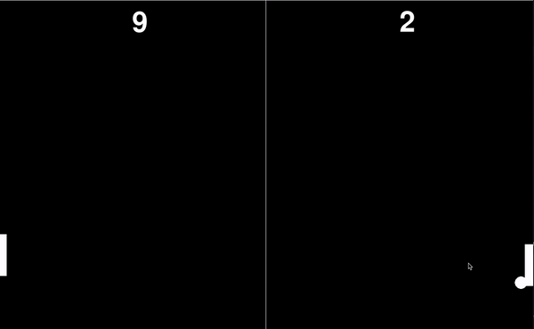

# Pong Game


This project is a classic Pong game implemented using Python's **Pygame** library. The game features a player-controlled paddle and a computer-controlled paddle that move vertically to hit the ball. The first player to reach the ball wins a point. The game is displayed on a window with a score counter for both the player and the computer.

## Features

- **Player vs. Computer Gameplay**: The player can move their paddle up and down to hit the ball, while the computer paddle automatically tracks the ball's position.
- **Score Tracking**: Points are awarded when the ball crosses a paddle boundary. The score is displayed at the top of the screen.
- **Real-Time Animations**: The ball and paddles move in real-time, with smooth animations and collision detection.

## Controls

- **UP Arrow**: Move the player's paddle up
- **DOWN Arrow**: Move the player's paddle down

## How to Play

1. **Launch the Game**: Run the Python script to start the game. A window will open displaying the Pong game.
2. **Play**: Use the UP and DOWN arrow keys to control your paddle and try to hit the ball before it crosses the paddle boundary.
3. **Scoring**: 
   - If the ball goes past the player’s paddle, the computer scores a point.
   - If the ball goes past the computer’s paddle, the player scores a point.
4. **End Game**: The game continues indefinitely until you close the window.

## Code Structure

- **Paddle and Ball Animation**:
  - The paddles are represented by rectangles, while the ball is an ellipse that moves across the screen.
  - The ball reverses direction when it collides with a paddle or the screen boundaries.


## Requirements

- **Python 3.x**
- **Pygame Library**

Install Pygame with:
```bash
pip install pygame
